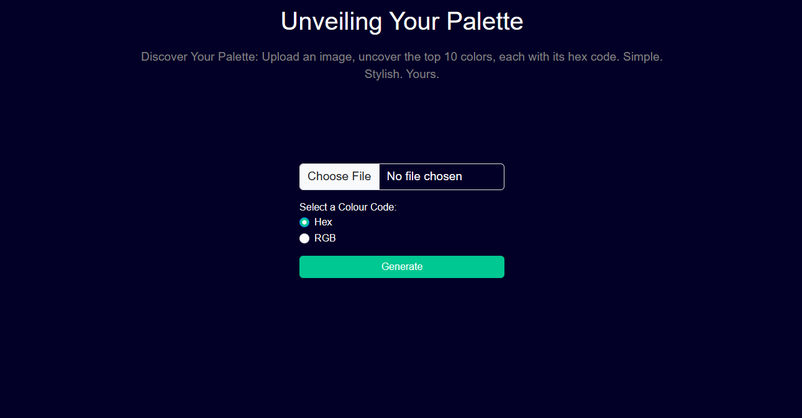
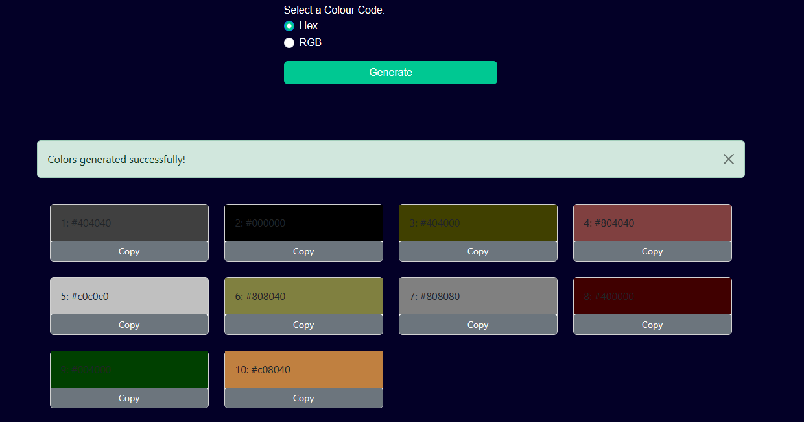
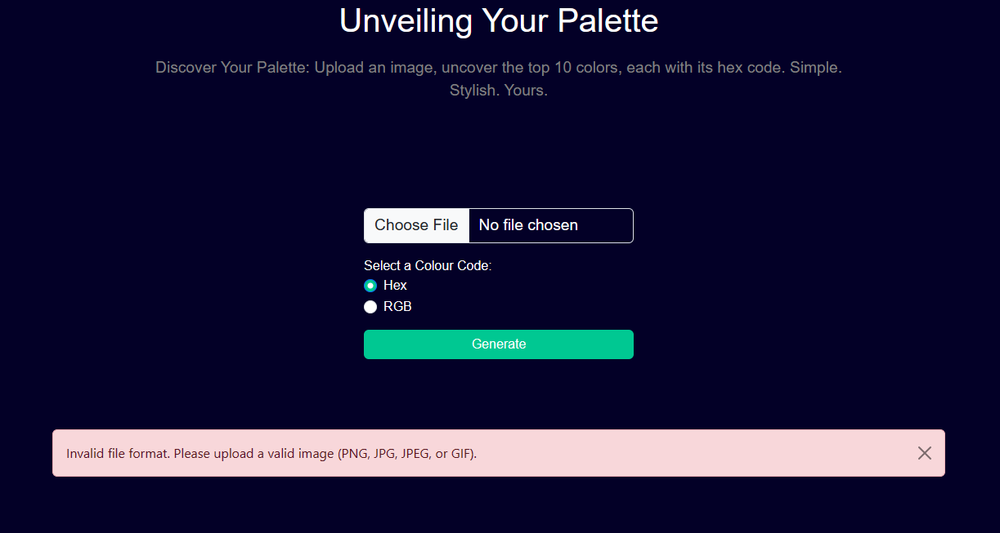

# ImageColorize: Unveiling Your Palette


## Description

ImageColorize is a simple and stylish web application that allows you to extract the top 10 colors from an uploaded image along with their corresponding hex or RGB codes. Whether you're a designer looking for color inspiration or an artist exploring the hues of your artwork, ImageColorize is here to help.

## Features

- Upload images in popular formats (PNG, JPG, JPEG, GIF).
- Choose between hex and RGB color code formats.
- Discover the top 10 most prominent colors in your image.
- Copy colors to your clipboard with a single click.
- Easy-to-use and responsive web interface.

## Screenshots






## Installation

1. Clone the repository:
   ```bash
   git clone https://github.com/yourusername/ImageColorize.git

2. Install the required packages:
    pip install -r requirements.txt

3. Start the Flask development server:
    python main.py

# Access the application at http://localhost:5000 in your web browser.

## Usage

1. Upload an image by clicking the "Choose File" button.
2. Select your preferred color code format (hex or RGB).
3. Click the "Generate" button to reveal the top 10 colors.
4. Click the "Copy" button next to each color to copy it to your clipboard.

## License

This project is licensed under the [MIT License](https://opensource.org/licenses/MIT) - see the [LICENSE](LICENSE) file for details.

## Contributing

Contributions are welcome!

## Acknowledgments

- [Flask](https://flask.palletsprojects.com/en/2.1.x/)
- [Bootstrap](https://getbootstrap.com/)

## Contact 
Tshwarelo Matinketja
Project Link: https://github.com/CS-TG/image_color_palette